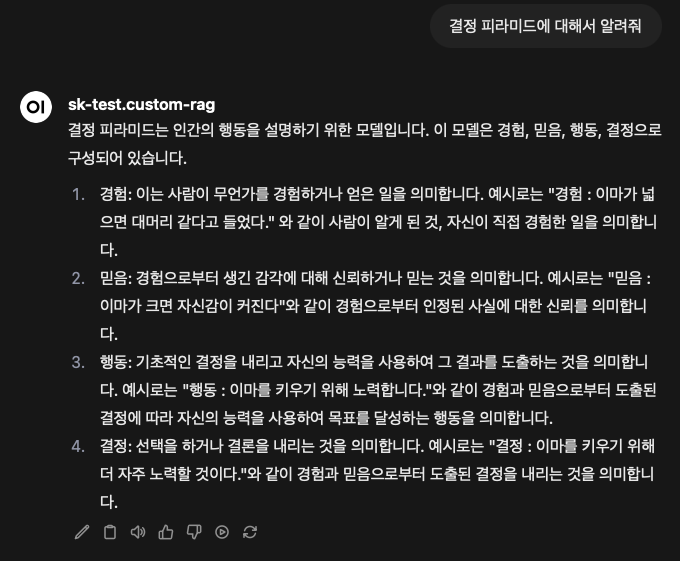
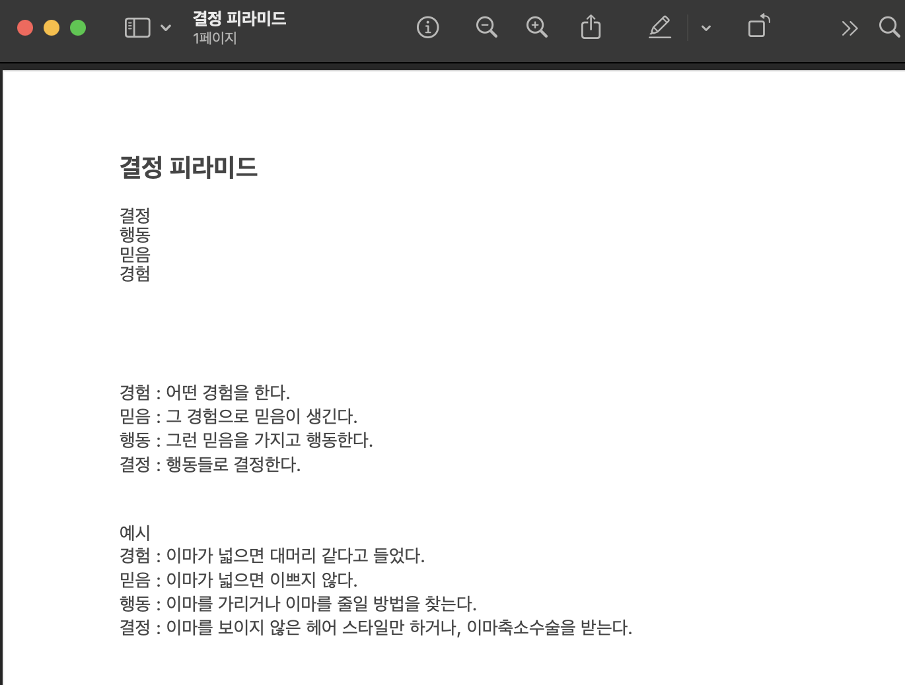

# 🧠 개인 AI 비서 프로젝트 (RAG + LLM)

> LLM 모델을 사용하여 **내 문서를 이해하는 개인 AI 비서**를 만든 프로젝트입니다.

---

## 🖼️ 아키텍처

📂 **문서 수집**  
사용자의 PDF, 메모, 이메일 등 다양한 개인 문서를 입력으로 사용합니다.

⬇️

📄 **텍스트 추출** (`PyMuPDF`)  
PDF 등에서 순수 텍스트를 추출합니다.

⬇️

✂️ **문장 분할** (`nltk`, `TextSplitter`)  
문서를 문장 단위로 나누어 의미 단위로 쪼갭니다.

⬇️

🧠 **문장 임베딩** (`sentence-transformers`)  
각 문장을 벡터로 변환해 의미 기반 검색이 가능하게 합니다.

⬇️

🗃️ **벡터 저장소** (`ChromaDB`)  
임베딩된 문장을 벡터 DB에 저장하여 검색합니다.

⬇️

🔍 **RAG 검색** (`LangChain Retriever`)  
질문과 가장 관련 있는 문장을 벡터 DB에서 검색합니다.

⬇️

🤖 **응답 생성** (`Ollama`, LLM 모델)  
검색된 문서를 기반으로 로컬 LLM이 답변을 생성합니다.

⬇️

🌐 **API 제공** (`FastAPI`)  
질문 → 응답 과정을 API 형태로 제공합니다.

⬇️

🖥️ **웹 인터페이스** (`Open WebUI`)  
사용자는 웹 UI에서 자연어로 질문하고 답을 받을 수 있습니다.

---

## 🚀 사용 기술

- Python 3.13
- [`ChromaDB`](https://github.com/chroma-core/chroma)
- [`sentence-transformers`](https://www.sbert.net/)
- [`LangChain`](https://www.langchain.com/)
- [`Ollama`](https://ollama.com/)
- [`FastAPI`](https://fastapi.tiangolo.com/)
- [`Poetry`](https://python-poetry.org/)
- [`Open WebUI`](https://github.com/open-webui/open-webui)

---

## 🧪 프로젝트 결과 예시

**질문**: 결정 피라미드에 대해서 알려줘

**답변**:  

**참조 문서**:  

---

## 📘 진행 과정

> 프로젝트 일지 및 구조 설명은 아래 Notion 링크에서 확인하실 수 있습니다.  
🔗 [Notion 프로젝트 문서 바로가기](https://www.notion.so/1ef4d126d75a809889c2f7a0caca823c?pvs=4)

